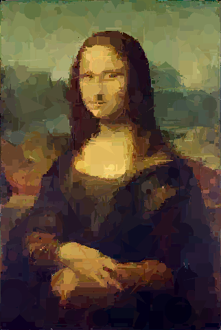

# Stupid art

[](https://travis-ci.org/nqpz/stupidart)

Approximate an input image by adding random shapes on top of each other.

Requires [Futhark](http://futhark-lang.org) and SDL2 and SDL2-ttf
libraries with associated header files.

## Building and running

To build, run `futhark pkg sync` once, and then `make`.

Run `./stupidart input.pam output.pam` to generate art.  You can use
ImageMagick's `convert` utility to convert an image into the Netpbm PAM
format.  Example:

```
convert input.jpg pam:- | ./stupidart - - | convert pam:- output.png
```

## Controls

  - `1`: Generate random shapes (default)
  - `2`: Generate only triangles
  - `3`: Generate only circles
  - `4`: Generate only rectangles
  - Space: Pause/unpause
  - F1: Toggle showing the text.
  - ESC: Save the current image (always without the text) to the output
    file and exit.
