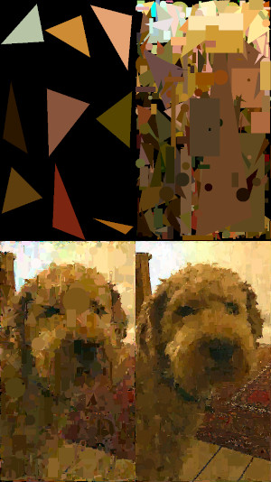

# Stupid art

[](https://travis-ci.org/nqpz/stupidart)

Approximate an input image by adding random shapes on top of each other
in parallel.

Dependency: [Futhark](http://futhark-lang.org).

Optional dependencies: The SDL2 and SDL2-ttf libraries with associated
header files.

## Building

To build, first run `futhark pkg sync` once.

Then run `make` to build.  To build without the SDL dependency, instead
run `STUPIDART_NO_INTERACTIVE=0 make`.  You can also use the
backend-specific `LYS_*` environment variables mentioned in
[Lys](https://github.com/diku-dk/lys).

## Running

Run `./stupidart input.pam output.pam` to generate art.  You can use
ImageMagick's `convert` utility to convert an image into the Netpbm PAM
format.  Example:

```
convert input.jpg pam:- | ./stupidart - - | convert pam:- output.png
```

Run `./stupidart --help` to see the available options.

## Controls for interactive use

Unless you run `stupidart -I`, you will watch the image as it is
generated (note that this is slower than the non-interactive approach due to some
internals).

  - `1`: Generate random shapes (default)
  - `2`: Generate only triangles
  - `3`: Generate only circles
  - `4`: Generate only rectangles
  - `r`: Reset
  - Space: Pause/unpause
  - F1: Toggle showing the text.
  - ESC: Save the current image (always without the text) to the output
    file and exit.
